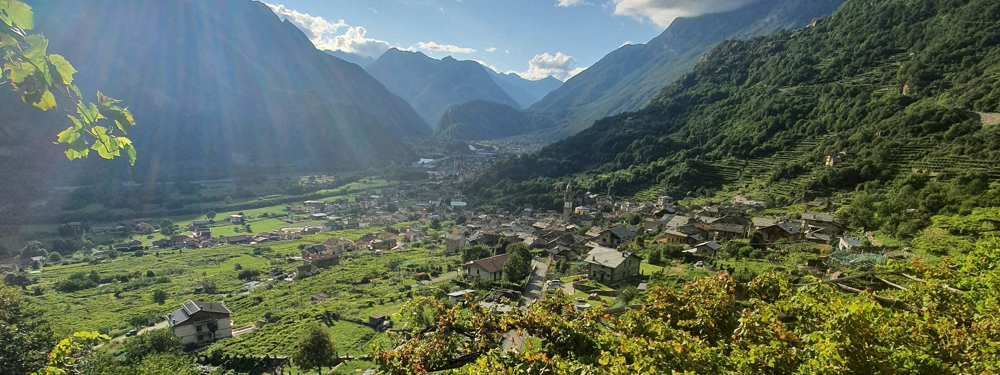
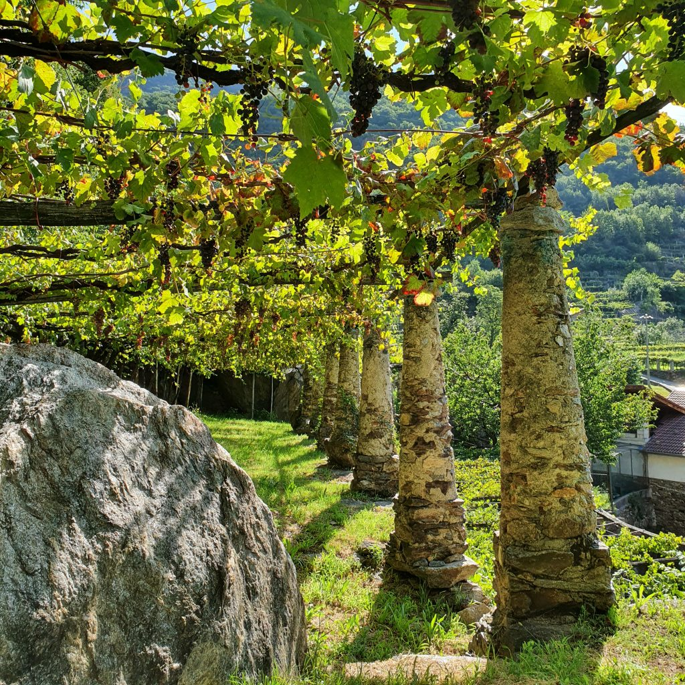

Apologies for the early announcement with regards to November wine club pick, but liquidity in some markets looks thin and really wanted to give everyone the chance to try this wine.

It was always going to be a Nebbiolo, but I found some difficulties in finding something relatively cheap and widely available.. until i realized that the answer was close to home. My hometown is 10 minutes away from the wineyards, and i used to be part of the village football team 

Carema is a very small village (800 inhabitants) at the border between Piemonte and Valle d'Aosta, where the valley itself is just few kilometers (if that) wide. The soil is rocky limestone of moraine origin and temperatures are cooler year round compared to the southern areas of Langhe and Monferrato.

The main grape produced is Nebbiolo, the picotender clone, farmed on the "pergola", a old substistance farming technique that allows the farmer to grow fruits and vegetables under the pergola, and grapes on top of it. Wineyards are on steep slopes between 300-600 meters and farming is extremely demanding, a vast majority of the wineyards can only be reached on foot.

The Carema DOC was one of the first ones in piemonte, established in 1967, and that is also when the co-operative Cantina dei Produttori di Carema was established. At the beginning of the 70s the area had 8 producers and 40 ha cultivated. With the passage of time people moved to the cities for better jobs, land was used for other purposes and in 2012 we only has 12ha cultivated for grapes and two producers, Produttori and Ferrando. Luckily since then things have changed a lot and young winemakers (from the area and across Italy) have come to Carema to work hard (very hard) and make wine, now we are counting more than 10 producers and 25ha cultivated.
As of 2015 the Cantina dei Produttori Nebbiolo di Carema was consituted by 71 part-time producers (average age is 55 yo) producing around 50000 bottles per year. Vast majority is Carema Etichetta Nera (base wine), followed by Etichetta Bianca (their riserva).

My pick, the Carema Riserva DOC undergoes 3 years of maturation in the cellar with at least 12 months in large oak barrels. Garnet red with light orange reflections it is definitely more delicate and weightless that its southern counterparts but i'd argue not less complex and intriguing.